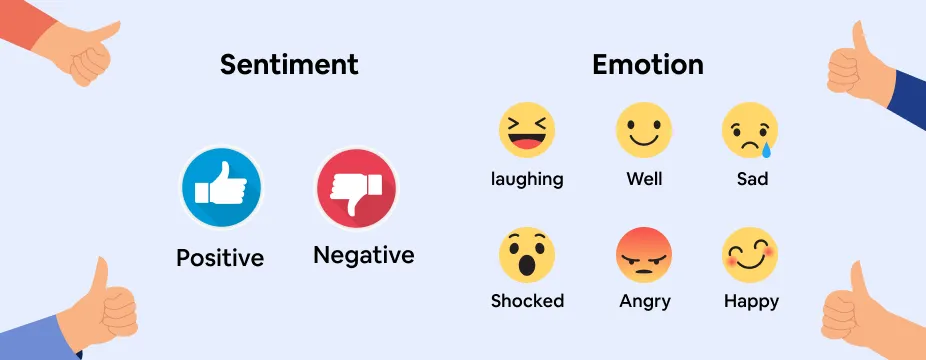
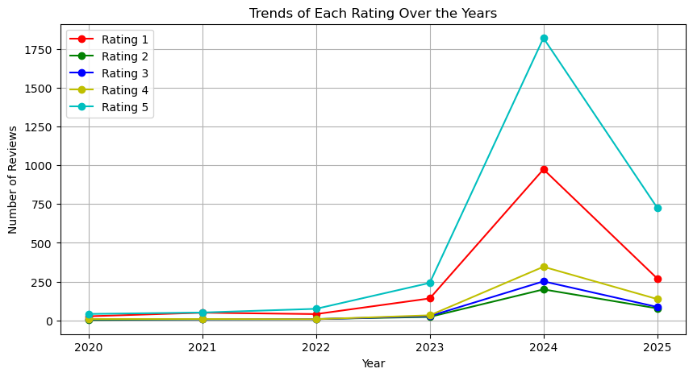
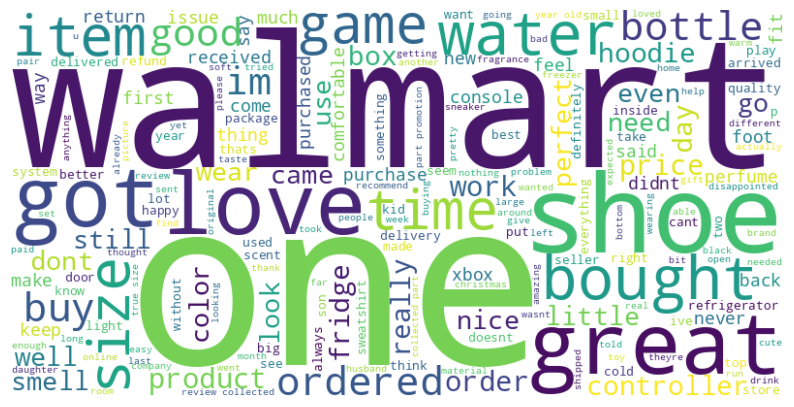
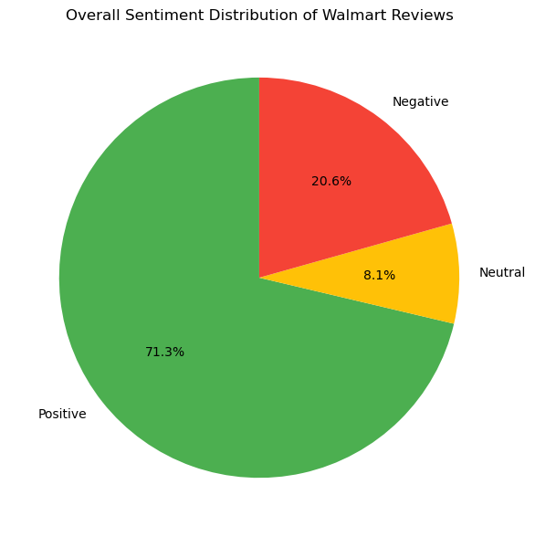

# Group3-Phase5-Project
# Authors
Group 3:
- [Gideon Ochieng](https://github.com/OchiengGideon)
- [Ann Mwangi](https://github.com/ann-mw)
- [Victor Masinde](https://github.com/Masinde10)
- [lorna Gatimu](https://github.com/lorna-creator)
- [Charles Odhiambo](https://github.com/T-hoveen)

### Technical Mentor
- Maryann Mwikali

# Sentiment Analysis Project



## **1. Business Understanding**
Online platforms like Walmart generate vast amounts of customer reviews daily. Manually extracting insights from these reviews is labor-intensive and inefficient. Traditional rating systems (1-5 stars) often fail to capture the true sentiment expressed in customer feedback. This project aims to build an automated sentiment analysis model to classify customer reviews into positive, negative, or neutral sentiments.

### Project Overview
The Sentiment Analysis project focuses on analyzing Walmart customer reviews to classify them into positive, negative, or neutral sentiments. The goal is to automate the extraction of insights from vast amounts of customer feedback, helping businesses improve products and services while enhancing customer satisfaction.

### Problem Statement
The main challenge is to accurately interpret and classify customer reviews at scale. Traditional star-rating systems lack depth in understanding customer sentiment, leading to gaps in customer insight. This project aims to provide a systematic, automated solution to categorize sentiment effectively.

### Objectives
1. Develop a Sentiment Analysis Model: Build an automated system to classify customer reviews into positive, negative, or neutral categories.  
2. Enhance Customer Insights: Analyze patterns and trends to improve understanding of customer opinions.  
3. Improve Product & Service Quality: Identify areas for improvement from negative sentiment analysis.  
4. Automate Review Analysis: Reduce manual review processes through automated sentiment classification.  
5. Refine Marketing & Customer Support Strategies: Use sentiment insights to enhance business strategies and customer engagement.

### Stakeholders
1. E-commerce Businesses & Sellers: Gain deeper insights into customer feedback to improve product quality and satisfaction.  
2. Consumers & Shoppers: Access reliable product sentiment to make informed purchasing decisions.  
3. Marketing & Customer Support Teams: Leverage sentiment insights to improve customer service and optimize marketing strategies.

## **2. Data Understanding**
The dataset was scraped from Walmart's online platform, containing customer reviews. The data was initially stored in multiple CSV files, which were later joined to form a single DataFrame. It consists of 7500 rows and 3 columns, including 'Review Text' (customer opinions in natural language stored as object/string data type), 'Star Ratings' (numerical ratings ranging from 1 to 5 stored as integer data type), and 'Customer Metadata' (additional information about the reviewers stored as object/string data type).

## **3. Data Preparation**
Key preprocessing steps include:  
1. Handling Missing Values: Identify and address missing or null entries.  
2. Text Preprocessing: Remove special characters, punctuation, and irrelevant information.  
3. Normalization: Standardize text by converting to lowercase and handling common word variations.

## **4. Exploratory Data Analysis (EDA)**

### Visualization 1: Sentiment Distribution
This visualization highlights the most frequently occurring words across customer reviews.

```
Word       Frequency
Great      1200
Bad        850
Quality    700
Fast       650
```

The word frequency analysis shows that positive terms like "great" and "quality" appear most often, suggesting a prevalence of favorable customer experiences. However, the presence of words like "bad" indicates areas of concern. This analysis helps identify key themes and commonly mentioned aspects of customer feedback.





## **5. Modeling**

### Model Selection
We employ the VADER (Valence Aware Dictionary and sEntiment Reasoner) tool for sentiment analysis. It is particularly effective for short texts like customer reviews. VADER assigns sentiment scores (positive, negative, neutral, and compound) based on a lexicon and rule-based approach.



## **6. Evaluation**

### Evaluation Metrics
Evaluation techniques include:  
- VADER Output: Assess the performance of the VADER model by comparing its sentiment predictions with labeled review sentiments.  
- Generalization: Test on unseen data to ensure the model performs accurately across varied datasets.

## **7. Deployment**

### Deployment Process
1. Save the VADER-based model for future use.  
2. Deploy the model for real-time sentiment classification or batch processing.  
3. Integrate with business applications to provide actionable insights.

Here are recommendations and a conclusion to add to your README:  


## **8. Recommendations**  

Based on the findings from our sentiment analysis project, we propose the following recommendations:  

1. **Improving Customer Support**  
   - Implement an automated review monitoring system that flags negative reviews for prompt customer service intervention.  
   - Provide personalized responses to dissatisfied customers to rebuild trust and enhance brand reputation.  

2. **Refining Sentiment Analysis Model**  
   - Continuously update the sentiment lexicon to capture evolving customer language trends.   

3. **Enhancing Customer Experience**  
   - Address common negative feedback themes to improve product quality and service delivery.  
   - Leverage positive sentiment insights to reinforce well-received features and maintain customer satisfaction.  


## **9. Conclusion**  

This project demonstrates the effectiveness of sentiment analysis in extracting valuable insights from customer reviews. By utilizing the VADER model, we successfully classified sentiments from Walmart reviews, providing businesses with actionable intelligence to enhance customer satisfaction. The findings highlight key sentiment trends, enabling companies to improve their products, services, and marketing strategies.  

Future improvements could involve integrating machine learning models like LSTMs or transformers (e.g., BERT) for deeper sentiment understanding. Additionally, expanding the dataset and refining preprocessing techniques can further enhance model accuracy.  

Ultimately, automated sentiment analysis proves to be a powerful tool for businesses seeking to make data-driven decisions, improve customer engagement, and drive overall growth.  


## **10. Access the Deployed App**  

You can interact with our Sentiment Analysis model through the deployed application using the link below:  

🔗 **[Live App](https://sentanaly.onrender.com/)**  

### **How to Use the App**  
1. **Select a Product**: Choose a product from the dropdown menu to view pre-analyzed reviews.  
2. **Upload a CSV File**: Alternatively, upload a CSV file containing reviews for a new product.  
3. **Analyze**: Click the "Analyze Reviews" button to process the data.  
4. **View Results**:  
   - The **Analysis Summary** table displays the sentiment for each review.  
   - The **Sentiment Distribution** chart shows the overall sentiment breakdown.  
   - Use the pagination controls to navigate through the results.  


For any issues or feedback, feel free to reach out!  

## Tools & Libraries Used
- Python: Core programming language.
- Pandas: Data manipulation and analysis.
- Matplotlib & Seaborn: Data visualization.
- NLTK: Natural Language Processing.
- VADER: Lexicon and rule-based sentiment analysis tool.


